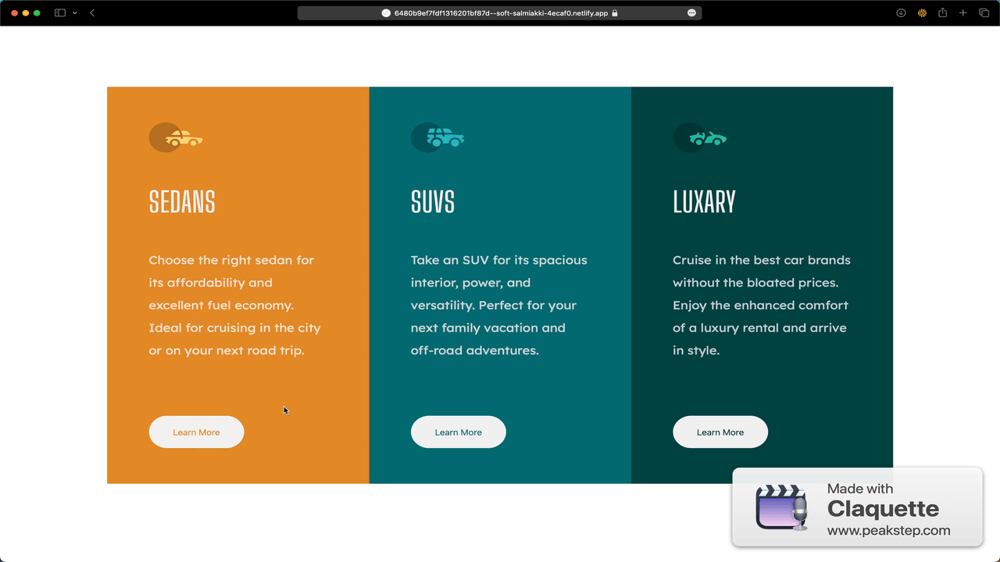

# Frontend Mentor - 3-column preview card component solution


## Table of contents

- [Overview](#overview)
  - [The challenge](#the-challenge)
  - [Screenshot](#screenshot)
  - [Links](#links)
- [My process](#my-process)
  - [Built with](#built-with)
  - [What I learned](#what-i-learned)
  - [Continued development](#continued-development)
  - [Useful resources](#useful-resources)
- [Author](#author)
- [Acknowledgments](#acknowledgments)


## Overview

### The challenge

Users should be able to:

- View the optimal layout depending on their device's screen size
- See hover states for interactive elements

### Screenshot



### Links

- [Live site](https://6480b9ef7fdf1316201bf87d--soft-salmiakki-4ecaf0.netlify.app)


## My process

### Built with

- Semantic HTML5 markup
- CSS custom properties
- Flexbox
- [React](https://reactjs.org/) - JS library
- [GSAP](https://styled-components.com/) - For animations


### What I learned

Creating the timeline in the ```useEffect()``` hook would throw errors because I was referencing the timeline within the component's JSX. I figured it would continue to work but had to create the timeline outside the ```useEffect()``` hook for it to be accessable in JSX.

Timeline created within the function, outside of ```useEffect()``` 

```js
function Section(props) {
  let tl
  ...
  return (
    ...
    <button 
        onMouseEnter={() => tl.play()}
        onMouseLeave={() => tl.reverse()}
        ...
      />
```
## Author

- Website - [Brian Thomas](https://www.your-site.com)
- Frontend Mentor - [@joyreacher](https://www.frontendmentor.io/profile/yourusername)

## Acknowledgments

See [this link](https://www.tutorialspoint.com/How-to-detect-a-mobile-device-with-JavaScript#:~:text=To%20detect%20a%20mobile%20device%20with%20JavaScript%20we%20are%20going,the%20server%20by%20the%20browser.) for more on how I was able to detect devices using javascript.
